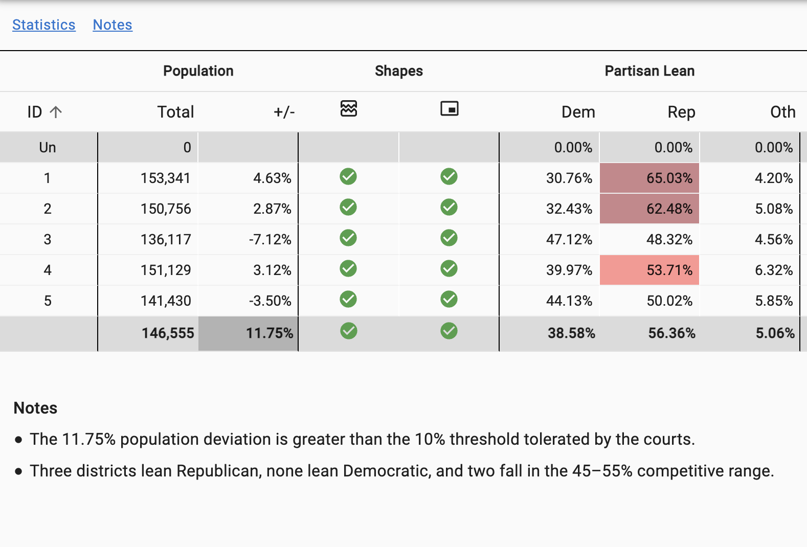

# Project3
DU Data Analysis Project 3 - Redistricting El Paso County, CO County Commissioner Districts

## Project Proposal
This project will focus on the redistricting happening now in El Paso County, CO for county commissioner districts.

## Background
The county is required to redistrict this year based on the 2020 census.
The image below shows information for the 5 current districts. This information is based on the 2020 Census and voter registration data in El Paso County, and is curtasy of the Dave's Redistricting website (https://davesredistricting.org).
Note that per current districting requirements, 3 of the 5 districts have too much population relative to the other districts.

## Proposed Dashboard

I propose to create a dashboard, implemented in CSS/HTML, Javascript, and Leaflet and using a backend Flask API implemented in python.
The database will be SQL.
My data sources will be the the Dave's Redistricting website (https://davesredistricting.org), Koordinates (https://koordinates.com/), El Paso County Elections Department and possibly the Colorado Secretary of State's demographer's department.

My dashboard will show a map of the El Paso County voting precincts.
The user will be able to select the current county commissioner districts and a couple of proposed new districts using layers.
Depending on the chosen district map layer, panels will display the following data refelective of the map's districts:
* Competitiveness of the district
  -  percentage of political party registrations
  - results from recent elections
* Demographic information on the district voters
* Information about district communities of interest
